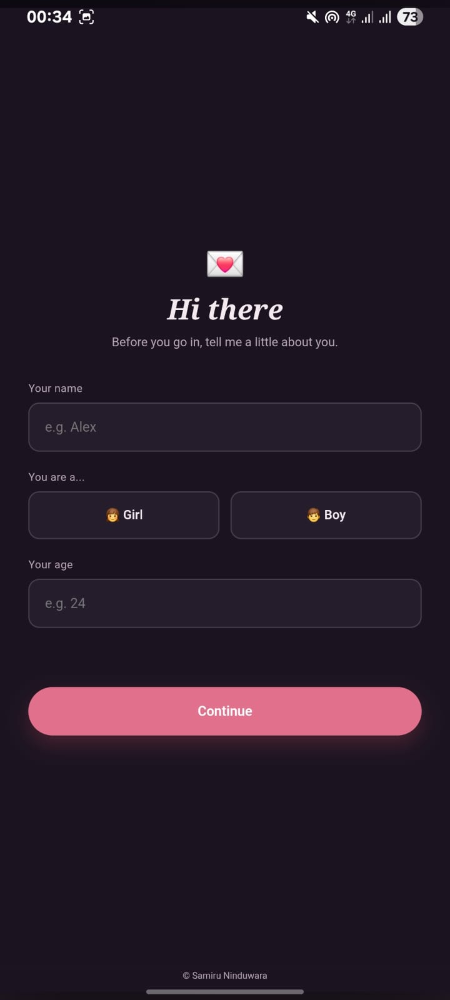
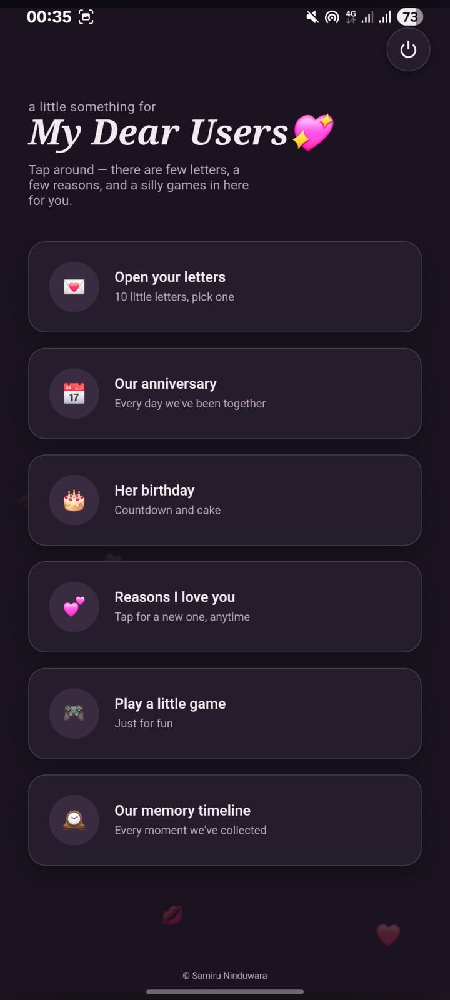
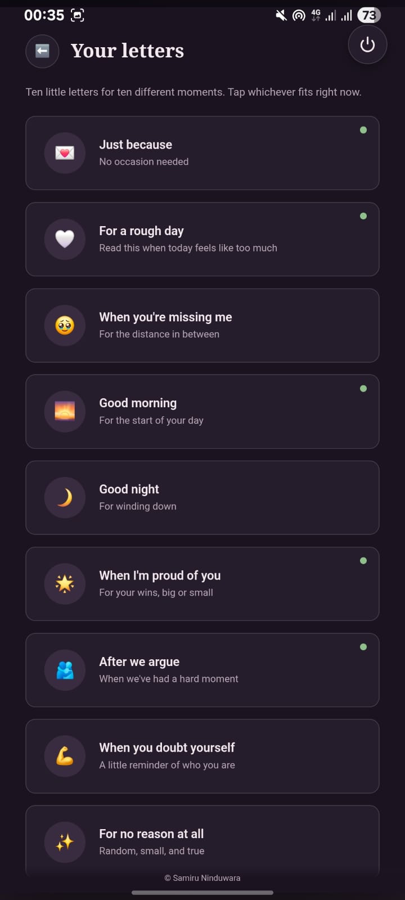
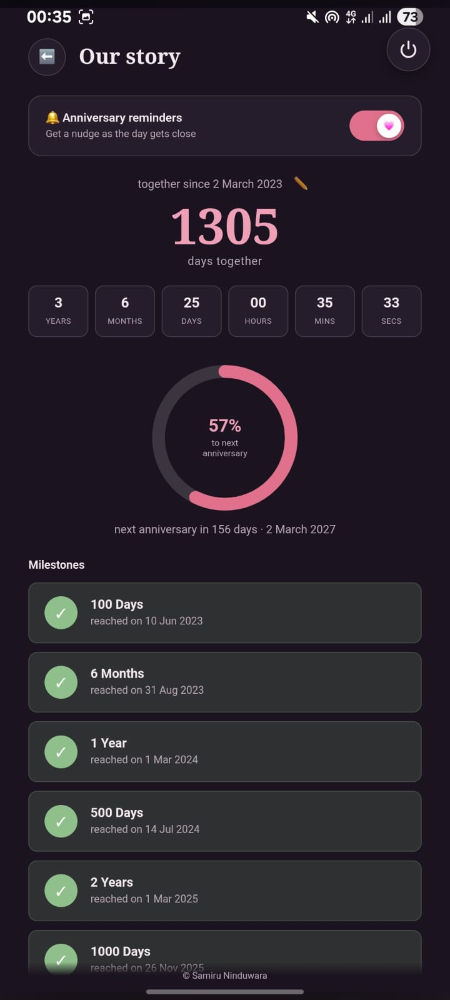
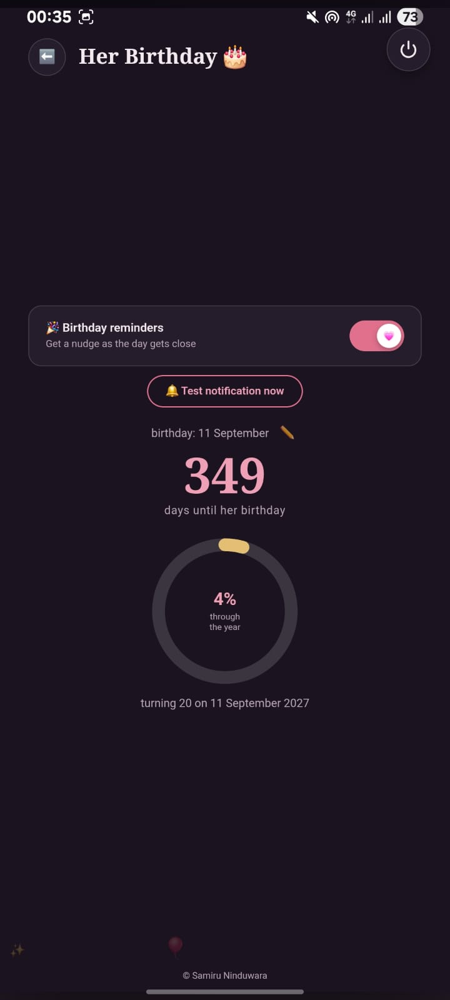
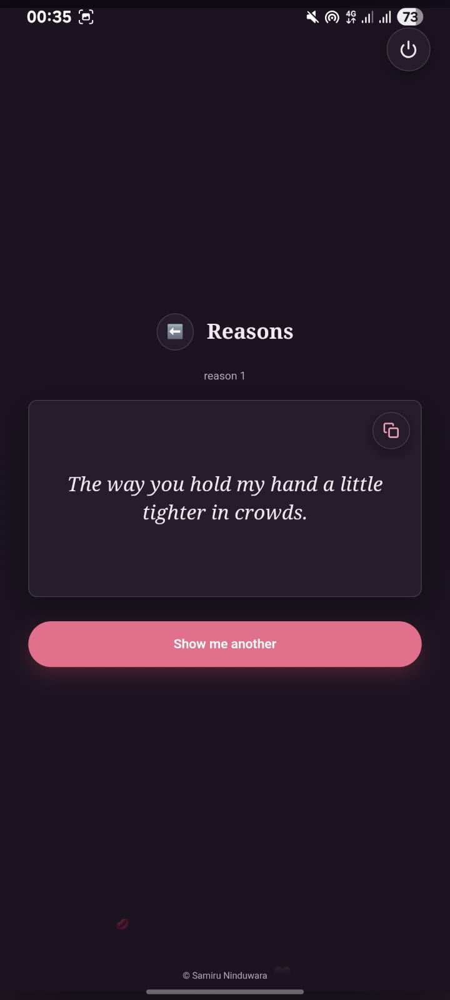
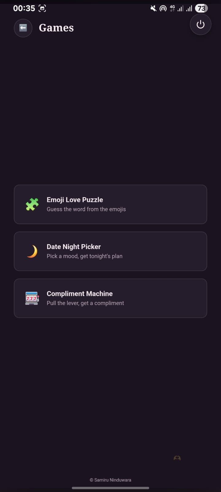
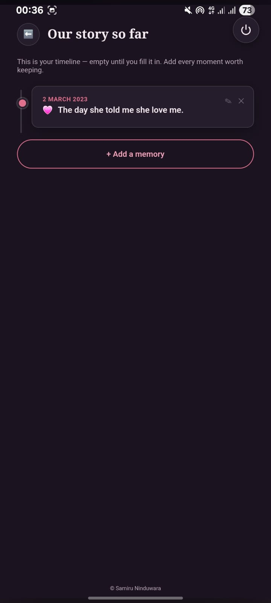

# 💗 Cute Lovers

**Cute Lovers** is my first Android application, created as a fun and creative project for couples and lovers.

The app combines romantic content, reminders, date selection, and a small word puzzle game into one simple Android application.

## ✨ Features

### 💌 Romantic Letters

Browse letters created for different moods and situations.

Users can easily **copy letters** and share or use them wherever they want.

### 🎂 Birthday Reminders

Save important birthdays and receive reminders so you don't forget special days.

### 💍 Anniversary Reminders

Keep track of important anniversaries and special dates.

### 📅 Date Picker

Select and manage important dates directly inside the application.

### 🧠 Memory Timeline 

add your special memories with note

### 💕 50+ Love Quotes

Users can easily **copy quotes** and share or use them wherever they want.

### 🧩 Word Puzzle Game

A simple word puzzle game designed to make the app more fun and interactive.

## 🛠️ Technologies

* Kotlin
* Android Studio
* Android SDK
* AndroidX
* HTML
* CSS
* JavaScript
* WebView

## 📱 Application

Cute Lovers was created as my **first Android application project** while learning and experimenting with Android development.

The project focuses on creating a fun user experience rather than being a large-scale production application.

## 📥 Download

> Download the latest APK from GitHub Releases and install it on your Android device.

## 📱 Screenshots

  
  
  

  
  
  

  
  

## 🔮 Future Improvements

* More romantic letter categories
* More reminder options
* Additional mini games
* Improved UI/UX
* More customization features

## 👨‍💻 Developer

**Samiru Ninduwara**

## 🎓 What I Learned

Building Cute Lovers as my first Android application helped me gain practical experience with:

* 📱 Android application development using Kotlin and Android Studio
* 🌐 Integrating HTML, CSS, and JavaScript with Android WebView
* 🎨 Designing and organizing a user-friendly mobile interface
* 🧩 Structuring an Android project and managing app resources
* ⏰ Working with reminders and date-based features
* 🎮 Building interactive app features and mini games
* 🔧 Using Git and GitHub for version control and project management

This project was created as a fun and creative learning experience, and it gave me a foundation for building more advanced Android applications in the future.

First Android Application Project
